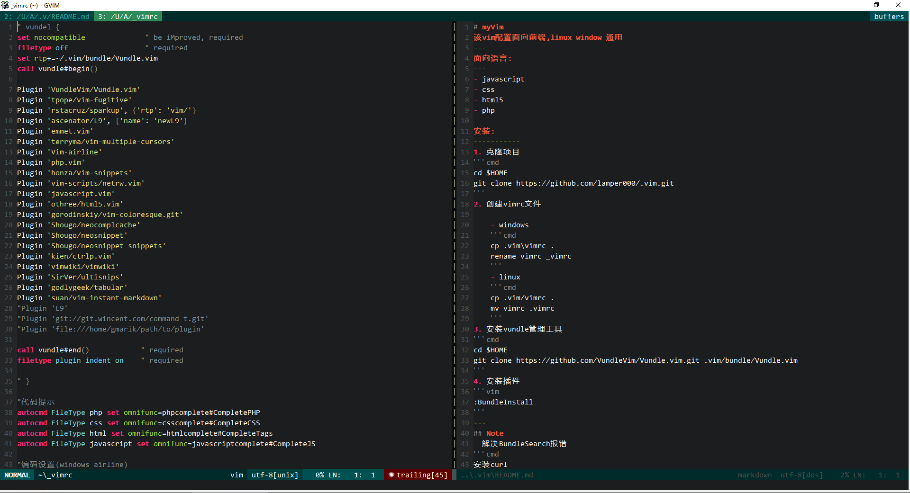

# myVim
该vim配置面向前端,linux window 通用
截图

---
面向语言:
---
- javascript
- css
- html5
- php

安装:
-----------
1. 克隆项目
```cmd
cd $HOME
git clone https://github.com/lamper000/.vim.git
```
2. 创建vimrc文件

	- windows
	```cmd
	cp .vim\vimrc .
	rename vimrc _vimrc
	```
	- linux
	```cmd
	cp .vim/vimrc .
	mv vimrc .vimrc
	```
3. 安装vundle管理工具
```cmd
cd $HOME
git clone https://github.com/VundleVim/Vundle.vim.git .vim/bundle/Vundle.vim
```
4. 安装插件
```vim
:BundleInstall
```
---
## Note
- 解决BundleSearch报错
```cmd
安装curl
```
- 添加py支持
